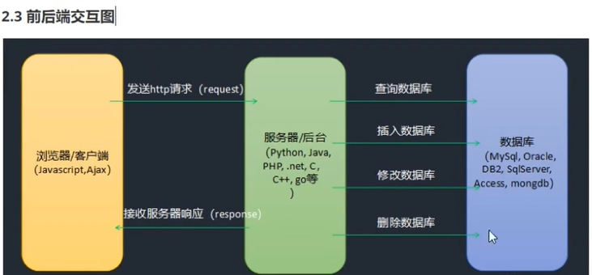

# 前端学习记录

前端语言--{javascript}

js的三大部分:
    1. ECMAScript(核心语言基础--类型,语法,关键字,保留字,操作符,对象)
    2. DOM(文档对象模型--操作网页内容)
    3. BOM(浏览器对象模型--和浏览器交互)

js也是脚本语言,写法和html,css一样,可以有:
    行内式;内嵌式;外链式

*Ajax技术:Asynchronous Javascript And Xml:异步JavaScript和XML技术:是一种创建交互式网页应用的开发技术--可以访问服务器数据的局部刷新*

**Ajax作用:允许客户端发送HTTP请求,去异步请求服务器的数据来动态创建网页----动态网页:和服务器有数据交互;静态网页:没有和服务器数据交互**

**心得1:JS的高级特性,多联想Python,C++的类比即可,不对在查资料**
**2023.11.18 千锋教育-kervin**