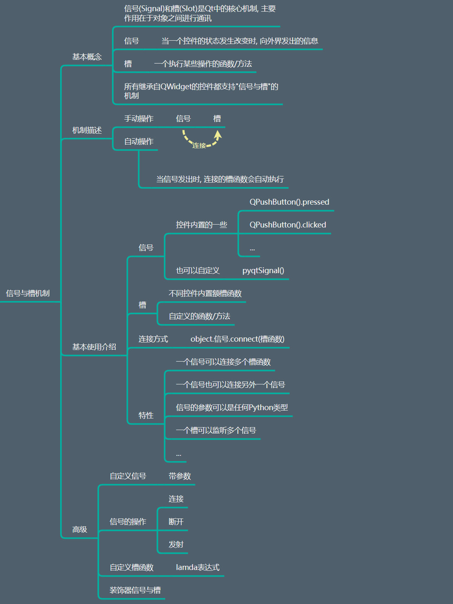

1. 信号（Signal）就是在特定情况下被发射（emit）的一种通告。
    例如一个PushButton按钮最常见的信号就是鼠标单击时发射的clicked()信号，一个ComboBox最常见的信号是选择的项变化时发射的CurrentIndexChanged()信号。GUI程序设计的主要内容就是对界面上各组件发射的特定信号进行响应，只需要知道什么情况下发射了哪些信号，然后合理地去响应和处理这些信号就可以了
2. 槽（Slot）就是对信号响应的函数。
    槽实质上是一个函数，它可以被直接调用。槽函数与一般的函数不同的是：槽函数可以与一个信号关联，当信号被发射时，关联的槽函数会被自动执行。Qt的类一般都有一些内建（build-in）的槽函数
3. 例如QWidget有一个槽函数close()，其功能是关闭窗口。如果将一个PushButton按钮的clicked()信号与窗体的close()槽函数关联，那么点击按钮时就会关闭窗口

