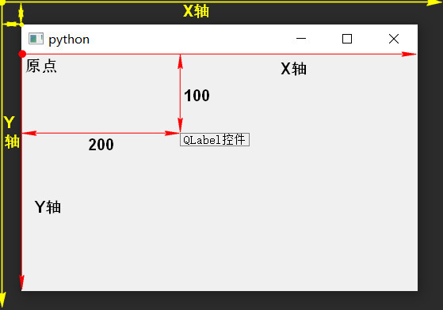

1. QWidget简介

    1.1 QWidget是所有的可视控件的基类
    1.2 描述
        所有的可视控件的基类
        是一个最简单的空白控件
        控件是用户界面的最小元素
        接收各种事件(鼠标事件，键盘事件)
        绘制在桌面上，展示给用户看
        每个控件都是矩形的，它们按Z轴顺序排序
        控件由其父控件和前面的控件剪切
        没有父控件的控件, 称之为窗口(顶层控件)
            一般会被包装成一个框架(标题栏...)
            可以通过某些设置进行更改
2. 左上角为坐标原点，向右为x轴正方向，向下为y轴正方向
   
3. 获取大小和位置的API

    API	                   说明
    x()	        相对于父控件的x位置，包含窗口框架。顶层控件则是相对于桌面的x位置
    y()	        相对于父控件的y位置，包含窗口框架。顶层控件则是相对于桌面的y位置
    pos()	    x和y的组合，包含窗口框架QPoint(x, y)
    width()	    控件的宽度，不包含任何窗口框架
    height()	控件的高度，不包含任何窗口框架
    size()	    width和height的组合QSize(width, height)
    geometry()	用户区域相对于父控件的位置和尺寸组合QRect(x,y,width,height)
    rect()	    0,0,width,height的组合Qrect(0,0,width,height)
    frameSize()	框架大小
    frameGeometry()	框架尺寸